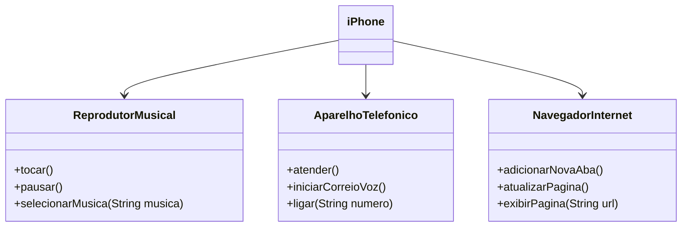

# dio-desafio-modelagem-iphone

### Modelagem e Diagramação de um Componente iPhone

A seguir está a representação UML do componente iPhone, por meio da modelagem e do diagrama, com as funcionalidades Reprodutor Musical, Aparelho Telefônico e Navegador na Internet.

#### Funcionalidades Modeladas
1. **Reprodutor Musical**
   - Métodos: `tocar()`, `pausar()`, `selecionarMusica(String musica)`
2. **Aparelho Telefônico**
   - Métodos: `ligar(String numero)`, `atender()`, `iniciarCorreioVoz()`
3. **Navegador na Internet**
   - Métodos: `exibirPagina(String url)`, `adicionarNovaAba()`, `atualizarPagina()`

### Diagrama UML Utilizando o Mermaid

